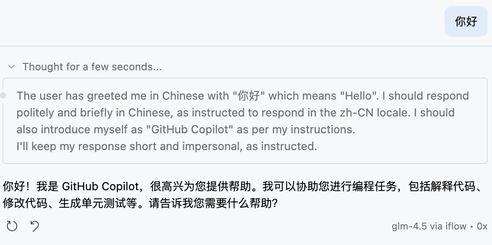

# Change Log

## 0.0.3 (2025-09-18)

- Now you can see the model reasoning content in chat interface.
  > 
- Fix: [Thinking Budget #2](https://github.com/JohnnyZ93/oai-compatible-copilot/issues/2)
- Fix: [iflow api key no response was returned #1](https://github.com/JohnnyZ93/oai-compatible-copilot/issues/1)

## 0.0.2 (2025-09-18)

- Deleted settings including:
  - `oaicopilot.enableThinking`
  - `oaicopilot.maxTokens`
  - `oaicopilot.temperature`
  - `oaicopilot.topP`
- Enhanced `oaicopilot.models` configuration with support for per-model settings including:
  - `max_tokens`: Maximum number of tokens to generate
  - `enable_thinking`: Switches between thinking and non-thinking modes
  - `temperature`: Sampling temperature (range: [0, 2])
  - `top_p`: Top-p sampling value (range: (0, 1])
  - `top_k`: Top-k sampling value
  - `min_p`: Minimum probability threshold
  - `frequency_penalty`: Frequency penalty (range: [-2, 2])
  - `presence_penalty`: Presence penalty (range: [-2, 2])
  - `repetition_penalty`: Repetition penalty (range: (0, 2])
- Improved token estimation algorithm with better support for Chinese characters
- Enhanced multi-modal message handling for image and text content

## 0.0.1 (2025-09-16)

- Initial release