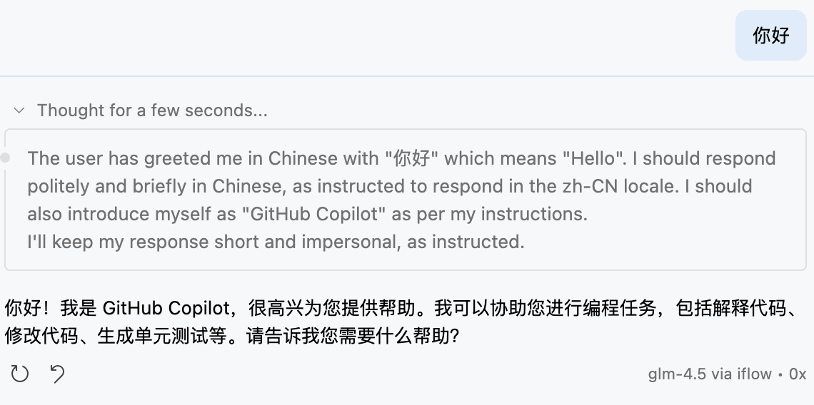

# 🤗 OAI Compatible Provider for Copilot

[](https://github.com/JohnnyZ93/oai-compatible-copilot/actions)
[](https://github.com/JohnnyZ93/oai-compatible-copilot/blob/main/LICENSE)

Use frontier open LLMs like Qwen3 Coder, Kimi K2, DeepSeek V3.1, GLM 4.5 and more in VS Code with GitHub Copilot Chat powered by any OpenAI-compatible provider 🔥

## ✨ Why Use the OAI Compatible Provider in Copilot
- Supports almost all OpenAI-compatible providers, such as ModelScope, SiliconFlow, DeepSeek...
- Supports vision models.
- Offers additional configuration options for chat requests.
- Supports control model thinking and reasoning content show in chat interface.
  > 

---

## ⚡ Quick Start
1. Install the OAI Compatible Provider for Copilot extension [here](https://marketplace.visualstudio.com/items?itemName=johnny-zhao.oai-compatible-copilot).
2. Open VS Code Settings and configure `baseUrl` and `models`.
3. Open VS Code's chat interface.
4. Click the model picker and select "Manage Models...".
5. Choose "OAI Compatible" provider.
6. Enter your API key — it will be saved locally.
7. Select the models you want to add to the model picker.

### Requirements
- VS Code 1.104.0 or higher.
- OpenAI-compatible provider API key.

### Settings Example

```json
"oaicopilot.baseUrl": "https://api-inference.modelscope.cn/v1",
"oaicopilot.models": [
    {
        "id": "Qwen/Qwen3-Next-80B-A3B-Instruct",
        "owned_by": "modelscope",
        "context_length": 256000,
        "max_tokens": 8192,
        "temperature": 0,
        "top_p": 1
    }
]
```

---

## 🛠️ Development
```bash
git clone https://github.com/JohnnyZ93/oai-compatible-copilot
cd oai-compatible-copilot
npm install
npm run compile
```
Press F5 to launch an Extension Development Host.

Common scripts:
- Build: `npm run compile`
- Watch: `npm run watch`
- Lint: `npm run lint`
- Format: `npm run format`
- Publish: `npx @vscode/vsce package -o extension.vsix`

---

## Thanks to
- Hugging Face Chat Extension: https://github.com/huggingface/huggingface-vscode-chat
- VS Code Chat Provider API: https://code.visualstudio.com/api/extension-guides/ai/language-model-chat-provider

---

## Support & License
- Open issues: https://github.com/JohnnyZ93/oai-compatible-copilot/issues
- License: MIT License Copyright (c) 2025 Johnny Zhao
